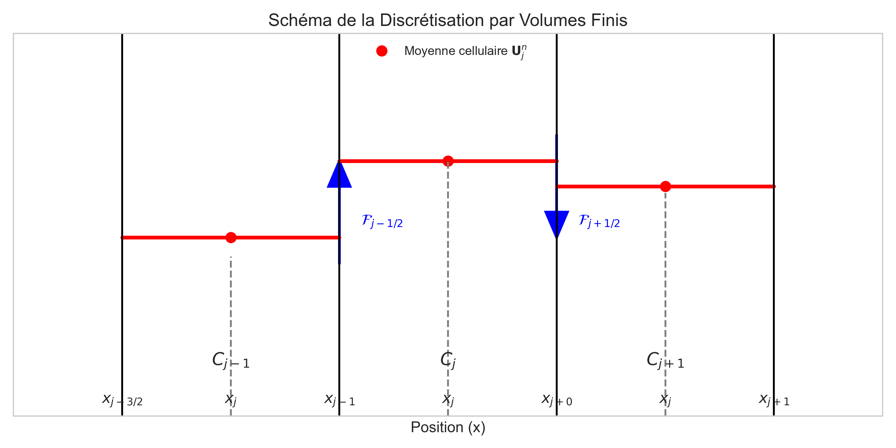
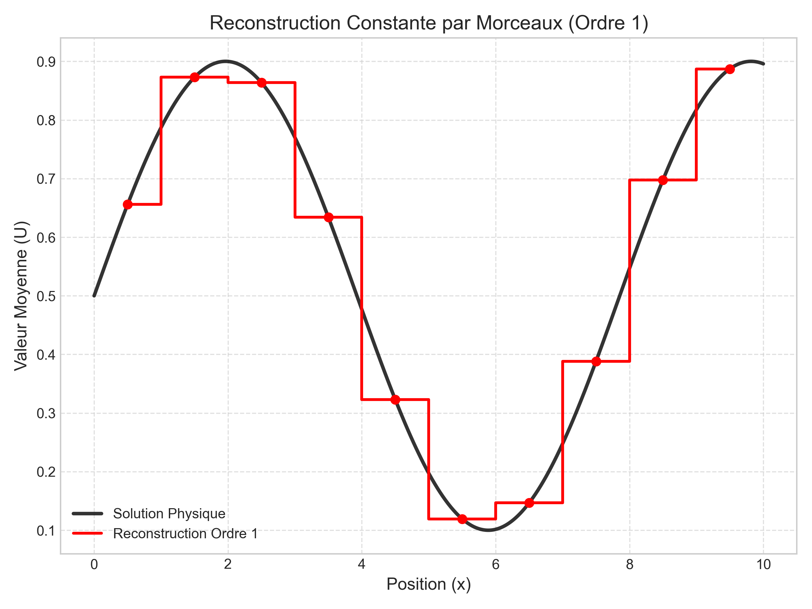
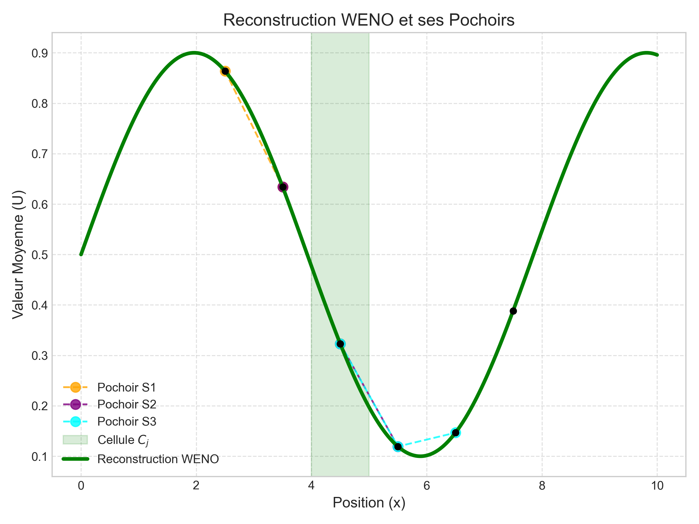

# Analyse Détaillée de la Chaîne Numérique et son Amélioration vers un Schéma d'Ordre Élevé

Ce document présente l'architecture de la chaîne de résolution numérique choisie pour la simulation du modèle ARZ multi-classes étendu. Nous commencerons par une description mathématique détaillée de la chaîne initiale, basée sur la méthode des volumes finis. Nous identifierons ensuite ses limitations inhérentes avant de présenter la mise à niveau vers un schéma WENO d'ordre élevé.

## 1. La Chaîne de Résolution Numérique Initiale

Notre modèle physique est un système d'équations aux dérivées partielles (EDP) hyperboliques non-linéaires, qui peut s'écrire sous la forme d'une loi de conservation avec un terme source :
$$
\frac{\partial \mathbf{U}}{\partial t} + \frac{\partial \mathbf{F}(\mathbf{U})}{\partial x} = \mathbf{S}(\mathbf{U}, x) \quad (*_*)
$$
Où :
- $\mathbf{U}$ est le vecteur des variables d'état (ex: $(\rho_m, w_m, \rho_c, w_c)^T$).
- $\mathbf{F}(\mathbf{U})$ est le **vecteur de flux**, qui décrit le transport des quantités.
- $\mathbf{S}(\mathbf{U}, x)$ est le **vecteur des termes sources**, qui décrit la création ou la perte locale de ces quantités (ex: relaxation de la vitesse).

La résolution numérique de ce système repose sur plusieurs choix fondamentaux, que nous allons détailler.

### 1.1 Discrétisation par Volumes Finis (FVM) : Le Cœur de la Méthode

La méthode des Volumes Finis est le fondement de notre approche spatiale. Son principal avantage est qu'elle est construite pour garantir la conservation des quantités au niveau discret, ce qui est physiquement indispensable pour les densités.

#### Dérivation de l'équation des Volumes Finis

L'idée centrale est d'étudier la variation de la quantité moyenne dans une cellule, plutôt que la valeur en un point. On discrétise le domaine spatial en cellules (ou "volumes finis") $C_j = [x_{j-1/2}, x_{j+1/2}]$ de largeur $\Delta x$. Ensuite, on intègre notre équation de départ $(*_*)$ sur toute la cellule $C_j$:

$$
\int_{x_{j-1/2}}^{x_{j+1/2}} \left( \frac{\partial \mathbf{U}}{\partial t} + \frac{\partial \mathbf{F}(\mathbf{U})}{\partial x} \right) dx = \int_{x_{j-1/2}}^{x_{j+1/2}} \mathbf{S}(\mathbf{U}, x) dx
$$

Le traitement de chaque terme de cette intégrale est différent, en raison de leur nature mathématique :

1.  **Le terme temporel :** L'intégrale et la dérivée temporelle peuvent être interverties. En utilisant la définition de la **moyenne cellulaire**, $\mathbf{U}_j(t) = \frac{1}{\Delta x} \int_{C_j} \mathbf{U}(x, t) dx$, ce terme devient :
    $$
    \int_{x_{j-1/2}}^{x_{j+1/2}} \frac{\partial \mathbf{U}}{\partial t} dx = \frac{d}{dt} \int_{x_{j-1/2}}^{x_{j+1/2}} \mathbf{U}(x,t) dx = \Delta x \frac{d\mathbf{U}_j(t)}{dt}
    $$

2.  **Le terme de flux :** Ce terme est l'intégrale d'une **dérivée spatiale**. Le **Théorème Fondamental de l'Analyse** s'applique parfaitement ici. Il stipule que l'intégrale de la dérivée d'une fonction est égale à la différence des valeurs de cette fonction à ses bornes. Ainsi, l'intégration "annule" la dérivation :
    $$
    \int_{x_{j-1/2}}^{x_{j+1/2}} \frac{\partial \mathbf{F}(\mathbf{U})}{\partial x} dx = \mathbf{F}(\mathbf{U}(x_{j+1/2}, t)) - \mathbf{F}(\mathbf{U}(x_{j-1/2}, t))
    $$
    Ce résultat est crucial : il transforme un phénomène volumique (la variation du flux dans la cellule) en un phénomène de surface (l'échange de flux aux frontières de la cellule).

3.  **Le terme source :** Le vecteur $\mathbf{S}$ **n'est pas une dérivée spatiale**, le Théorème Fondamental ne s'applique donc pas. Nous ne pouvons pas simplifier cette intégrale. Nous la traitons donc comme un tout, en définissant la **moyenne du terme source** sur la cellule $j$ :
    $$
    \mathbf{S}_j(t) = \frac{1}{\Delta x} \int_{x_{j-1/2}}^{x_{j+1/2}} \mathbf{S}(\mathbf{U}(x, t), x) dx
    $$

En rassemblant ces trois résultats et en divisant par $\Delta x$, on obtient l'équation semi-discrète **exacte** pour la moyenne cellulaire :
$$
\frac{d\mathbf{U}_j(t)}{dt} + \frac{1}{\Delta x} \left[ \mathbf{F}(\mathbf{U}(x_{j+1/2}, t)) - \mathbf{F}(\mathbf{U}(x_{j-1/2}, t)) \right] = \mathbf{S}_j(t)
$$

Le défi est que nous ne connaissons que les moyennes $\mathbf{U}_j$, pas les valeurs exactes aux interfaces. La méthode des volumes finis consiste alors à approximer les flux exacts $\mathbf{F}$ par un **flux numérique** $\mathcal{F}$. Le système que l'on résout numériquement pour avancer d'un temps $t^n$ à $t^{n+1}$ est :
$$
\frac{d\mathbf{U}_j}{dt} = -\frac{1}{\Delta x} \left[ \mathcal{F}_{j+1/2} - \mathcal{F}_{j-1/2} \right] + \mathbf{S}(\mathbf{U}_j)
$$
Le calcul de ce flux numérique est au cœur du schéma. Il se base sur les valeurs **connues** au début du pas de temps, $\mathbf{U}_j^n$ et $\mathbf{U}_{j+1}^n$, car le flux à l'interface est une interaction entre les deux cellules voisines : $\mathcal{F}_{j+1/2} = \mathcal{F}(\mathbf{U}_j^n, \mathbf{U}_{j+1}^n)$.

*Figure 1 : Schéma de la discrétisation par Volumes Finis. La variation de la quantité moyenne $\mathbf{U}_j$ dans la cellule $j$ est déterminée par la différence entre le flux entrant $\mathcal{F}_{j-1/2}$ et le flux sortant $\mathcal{F}_{j+1/2}$ à ses frontières.*

### 1.2 Schéma du Premier Ordre : Reconstruction et Flux

Pour calculer le flux numérique $\mathcal{F}_{j+1/2}$, il faut d'abord **reconstruire** une approximation de l'état $\mathbf{U}(x)$ à partir des moyennes cellulaires $\mathbf{U}_j$.

Dans un schéma du **premier ordre**, la reconstruction est la plus simple possible : on suppose que la solution est **constante par morceaux** (piecewise constant) dans chaque cellule.
$$
\mathbf{U}(x) \approx \mathbf{U}_j \quad \forall x \in C_j
$$
Cette approximation "en escalier" est robuste mais très peu précise.

*Figure 2 : La reconstruction du premier ordre approxime une solution lisse (courbe noire) par une fonction constante par morceaux (barres rouges). C'est la source principale de l'imprécision du schéma.*

À chaque interface $x_{j+1/2}$, cette reconstruction crée une discontinuité entre l'état à gauche, $\mathbf{U}_L = \mathbf{U}_j^n$, et l'état à droite, $\mathbf{U}_R = \mathbf{U}_{j+1}^n$. C'est un **problème de Riemann** local. Le flux numérique $\mathcal{F}_{j+1/2}$ est alors une approximation de la solution de ce problème. Nous utilisons le schéma **Central-Upwind (CU)**, dont le flux s'écrit conceptuellement :
$$
\mathcal{F}_{j+1/2}^{\text{CU}} = f(\mathbf{U}_j^n, \mathbf{U}_{j+1}^n, a_{j+1/2}^+, a_{j+1/2}^-)
$$
où $a^+$ et $a^-$ sont les vitesses d'onde locales les plus rapides (calculées à partir des valeurs propres du système), qui déterminent la quantité de "décentrage" (upwinding) nécessaire pour la stabilité.

### 1.3 Gestion des Sources : Fractionnement de Strang

Les termes de relaxation dans $\mathbf{S}(\mathbf{U})$ peuvent être "raides" (agir sur des échelles de temps très courtes), ce qui pose un problème de stabilité. Nous utilisons le **fractionnement de Strang (Strang Splitting)** pour découpler la résolution de la partie hyperbolique (transport) de celle des sources (relaxation).

Pour avancer d'un pas de temps $\Delta t$, on résout séquentiellement :
1.  **Solveur ODE (demi-pas) :** $\frac{d\mathbf{U}}{dt} = \mathbf{S}(\mathbf{U})$ pendant $\Delta t / 2$.
2.  **Solveur Hyperbolique (pas complet) :** $\frac{\partial \mathbf{U}}{\partial t} + \frac{\partial \mathbf{F}(\mathbf{U})}{\partial x} = 0$ pendant $\Delta t$.
3.  **Solveur ODE (demi-pas) :** $\frac{d\mathbf{U}}{dt} = \mathbf{S}(\mathbf{U})$ pendant $\Delta t / 2$.

Cette approche garantit la stabilité et atteint une précision du second ordre en temps si les solveurs internes sont suffisamment précis.

## 2. Le Point Faible Identifié : La Diffusion Numérique

La robustesse de la chaîne initiale a un coût : la **diffusion numérique**. Elle est la conséquence directe de la reconstruction constante par morceaux (Figure 2). En "moyennant" les discontinuités, le schéma "floute" les ondes de choc sur plusieurs cellules.

Cette information corrompue et "floutée" est ensuite utilisée par le solveur de relaxation, qui réagit de manière incorrecte et peut générer des artefacts non-physiques, comme le dépassement de la densité maximale.

## 3. L'Amélioration : Schéma WENO d'Ordre Élevé

La solution consiste à remplacer la reconstruction constante par une **reconstruction polynomiale de haute précision**, tout en évitant de générer des oscillations près des chocs. C'est le rôle du schéma **WENO (Weighted Essentially Non-Oscillatory)**.

### 3.1 Le Principe : Reconstruction Polynomiale Intelligente

Au lieu d'une valeur constante, WENO construit dans chaque cellule $j$ un polynôme de haut degré $P_j(x)$ qui approxime la solution. Pour ce faire, il combine de manière "intelligente" plusieurs polynômes candidats, chacun construit sur un "pochoir" (stencil) de cellules différent.

Pour la reconstruction à gauche de l'interface $x_{j+1/2}$, la valeur est :
$$
u^-_{j+1/2} = \omega_1 p_1(x_{j+1/2}) + \omega_2 p_2(x_{j+1/2}) + \omega_3 p_3(x_{j+1/2})
$$
-   $p_k$ sont des polynômes candidats (ordre 2).
-   $\omega_k$ sont les **poids non-linéaires**, qui sont le cœur de WENO.

Les poids sont calculés à partir d'**indicateurs de régularité** $\beta_k$ qui mesurent la "lisseté" de la solution sur chaque pochoir. Si un pochoir traverse un choc, son $\beta_k$ devient très grand, et son poids $\omega_k$ devient quasi nul. Le schéma "rejette" ainsi l'information contaminée et préserve la netteté du choc.

*Figure 3 : Le principe de WENO. Pour reconstruire la solution dans la cellule $j$ (en vert), WENO considère plusieurs pochoirs (S1, S2, S3). Il combine intelligemment les polynômes basés sur ces pochoirs pour former une approximation de haute précision, tout en rejetant les pochoirs qui traversent des discontinuités.*

### 3.2 Intégration et Intégration Temporelle

Cette reconstruction de haute précision remplace directement l'étape de reconstruction du premier ordre. Cependant, pour préserver cette précision, l'intégrateur temporel doit aussi être d'ordre élevé. Nous utilisons un schéma **Runge-Kutta à forte stabilité (SSP-RK3)**. L'étape hyperbolique du splitting devient :
$$
\begin{align*}
\mathbf{U}^{(1)} &= \mathbf{U}^n + \Delta t L(\mathbf{U}^n) \\
\mathbf{U}^{(2)} &= \frac{3}{4}\mathbf{U}^n + \frac{1}{4}\mathbf{U}^{(1)} + \frac{1}{4}\Delta t L(\mathbf{U}^{(1)}) \\
\mathbf{U}^{n+1} &= \frac{1}{3}\mathbf{U}^n + \frac{2}{3}\mathbf{U}^{(2)} + \frac{2}{3}\Delta t L(\mathbf{U}^{(2)})
\end{align*}
$$
où $L(\mathbf{U}) = -\frac{1}{\Delta x} \left[ \mathcal{F}_{j+1/2} - \mathcal{F}_{j-1/2} \right]$ est l'opérateur spatial qui utilise maintenant la reconstruction WENO.

## 4. Conclusion : Une Chaîne Numérique de Haute-Fidélité

En remplaçant la reconstruction constante par WENO5 et l'intégrateur d'Euler par SSP-RK3, nous avons transformé la chaîne numérique. Cette mise à niveau ciblée élimine les artefacts de diffusion, permet une capture nette des chocs, et fournit des résultats quantitativement fiables. La plateforme de simulation est ainsi passée d'un outil qualitatif à un instrument d'analyse prédictive.

---
