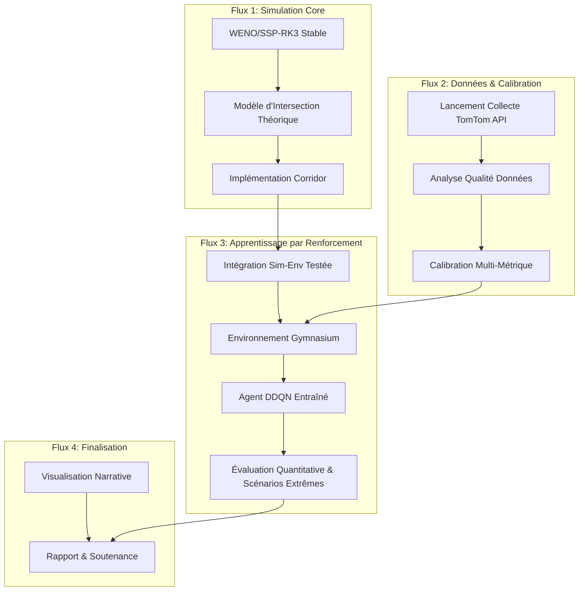

### **Document 1 : `planning.md` (Version Finale Raffinée)**

## **Feuille de Route d'Exécution Technique - Projet Jumeau Numérique & RL**
### Juillet - Novembre 2025

#### **Vue d'Ensemble - Flux de Travail et Dépendances Techniques**

## **Feuille de Route d'Exécution Finale et Complète**
### Période : 10 Juillet - 14 Novembre 2025

---

###  **PHASE 1 : FONDATIONS & VALIDATION DU SIMULATEUR HAUTE-FIDÉLITÉ** (5 Semaines : 10 Juillet - 13 Août)
**Objectif Clé :** Produire un simulateur de corridor stable (WENO/SSP-RK3), dont la validité numérique et physique est prouvée, et calibré sur des données réelles.

#### **Semaine 1 (10 juil. - 16 juil.) : Implémentation du Cœur Numérique (WENO5/SSP-RK3)**
- **Objectif :** Construire le cœur algorithmique du simulateur et lancer la collecte de données en tâche de fond.
- **Livrables :**
  - **1.1.1 : [Code Source]** Fichiers `reconstruct_weno5.py` et `solve_hyperbolic_step_ssprk3.py` finalisés et documentés.
  - **1.1.2 : [Script de Collecte]** Script `tomtom_collector.py` déployé et opérationnel, générant des logs de données (`.json`) horodatés.

#### **Semaine 2 (17 juil. - 23 juil.) : Validation Numérique Fondamentale**
- **Objectif :** Prouver mathématiquement que l'implémentation du solveur est correcte et, en parallèle, initialiser l'infrastructure de rédaction du rapport final.
- **Livrables :**
  - **1.2.1 : [Graphe de Validation]** Figure `results/convergence_test.png` - *Montrant l'erreur L1 vs. Δx avec une pente > 2.5, prouvant l'ordre de précision.*
  - **1.2.2 : [Graphe de Validation]** Figure `results/conservation_positivity_test.png` - *Prouvant une erreur de conservation < 1e-14 et le maintien de la positivité des densités.*
  - **1.2.3 : [Initialisation du Rapport]** (Tâche de fond) Mise en place du plan document de mémoire (`memoire.tex`, bibliographie) et de l'environnement de compilation LaTeX.

#### **Semaine 3 (24 juil. - 30 juil.) : Validation Phénoménologique (Anti-Artefact)**
- **Objectif :** Démontrer la fidélité physique du simulateur en validant sa capacité à corriger les défauts connus des modèles plus simples.
- **Livrables :**
  - **1.3.1 : [Graphe de Validation]** Figure `results/shockwave_profile.png` - *Montrant une onde de choc nette, sans oscillations numériques, pour le scénario "Route Dégradée".*
  - **1.3.2 : [Graphe de Validation]** Figure `results/jam_density_test.png` - *Apportant la preuve visuelle que la densité ne dépasse jamais la densité maximale (\(\rho_m \le \rho_{jam}\)) au front de choc.*

#### **Semaine 4 (31 juil. - 6 août) : Modélisation et Implémentation des Jonctions**
- **Objectif :** Développer et implémenter la logique de gestion des flux aux intersections pour un réseau de routes.
- **Livrables :**
  - **1.4.1 : [Document de Conception]** `docs/junction_model_decision.md` - *Formalisant le modèle "Supply-Demand" retenu et sa justification.*
  - **1.4.2 : [Code Source]** Classe `numerics/JunctionSolver.py` - *Implémentant le modèle de jonction de manière testable et modulaire.*

#### **Semaine 5 (7 août - 13 août) : Calibration Multi-Métrique Initiale**
- **Objectif :** Ancrer le simulateur dans la réalité physique du corridor d'étude en le calibrant avec les données collectées.
- **Livrables :**
  - **1.5.1 : [Rapport d'Analyse]** Notebook `analysis/data_quality_report.ipynb` - *Évaluant la complétude, cohérence et couverture des données TomTom.*
  - **1.5.2 : [Fichier de Configuration]** `config/corridor_lagos_calibrated.yml` - *Contenant les paramètres du modèle optimisés pour minimiser l'erreur MAPE composite.*

---

###  **PHASE 1.5 : INTÉGRATION & RAFFINEMENT** (1 Semaine : 14 Août - 20 Août)
**Objectif Clé :** Assurer une transition technique sans friction entre le simulateur et le futur environnement d'IA.

#### **Semaine 6 (14 août - 20 août) : Tests d'Intégration et Documentation Technique**
- **Livrables :**
  - **1.5.1 : [Script de Test]** `test/test_integration_env_simulator.py` - *Validant que les appels `reset()` et `step()` entre l'environnement et le simulateur s'exécutent sans erreur.*
  - **1.5.2 : [Document de Capitalisation]** `docs/lessons_learned.md` - *Synthétisant les défis et solutions de la Phase 1 pour référence future.*

---

###  **PHASE 2 : CONSTRUCTION DE L'AGENT D'IA** (4 Semaines : 21 Août - 17 Septembre)
**Objectif Clé :** Construire un agent d'apprentissage par renforcement fonctionnel, capable de converger vers une politique de contrôle de trafic.

#### **Semaines 7-8 (21 août - 3 sept.) : Création de l'Environnement `Gymnasium`**
- **Objectif :** Encapsuler le simulateur dans une interface standardisée (Gymnasium) pour l'entraînement de l'agent RL.
- **Livrables :**
  - **2.1.1 : [Code Source]** Classe `environments/TrafficCorridorEnv.py` - *Contenant les `observation_space`, `action_space` et la logique de `step()` et `reset()`.*
  - **2.1.2 : [Test Unitaire]** Script `test/test_reward_function.py` - *Validant le calcul de la récompense sur des scénarios de test définis.*

#### **Semaines 9-10 (4 sept. - 17 sept.) : Entraînement et Suivi de l'Agent Double DQN**
- **Objectif :** Entraîner l'agent DDQN et s'assurer qu'il apprend une stratégie de contrôle pertinente en surveillant sa convergence.
- **Livrables :**
  - **2.2.1 : [Code Source]** Classe `agents/DDQNAgent.py` - *Incluant les mécanismes de Replay Buffer et de mise à jour du réseau cible.*
  - **2.2.2 : [Logs d'Entraînement]** Dossier `runs/ddqn_experiment_logs/` - *Contenant les fichiers TensorBoard pour visualiser les courbes de récompense, perte, et la décroissance d'epsilon.*
  - **2.2.3 : [Modèle Entraîné]** Fichier `models/ddqn_agent_final.pth` - *Contenant les poids du Q-Network de l'agent le plus performant.*

---

### 📊 **PHASE 3 : ÉVALUATION ROBUSTE & DÉMONSTRATION** (4 Semaines : 18 Septembre - 15 Octobre)
**Objectif Clé :** Prouver quantitativement la supériorité de l'agent RL et communiquer ses résultats de manière impactante.

#### **Semaines 11-12 (18 sept. - 1er oct.) : Analyse de Performance et de Robustesse**
- **Objectif :** Évaluer rigoureusement les performances de l'agent par rapport à une politique de référence, y compris dans des conditions dégradées.
- **Livrable :**
  - **3.1.1 : [Rapport de Performance]** Notebook `analysis/performance_evaluation.ipynb` - *Présentant le tableau comparatif des KPIs, les box-plots de variance, et l'analyse du scénario d'incident.*

#### **Semaines 13-14 (2 oct. - 15 oct.) : Développement du Visualiseur et Démonstration Narrative**
- **Objectif :** Créer un outil de démonstration visuel et une vidéo narrative pour communiquer efficacement la valeur du projet.
- **Livrables :**
  - **3.2.1 : [Application de Visualisation]** Dossier `visualizer/` - *Contenant une application web autonome (HTML/JS) capable d'animer un fichier de simulation sur une carte.*
  - **3.2.2 : [Vidéo de Démonstration]** Fichier `demo_final.mp4` - *Vidéo de 2-3 minutes suivant un arc narratif (Problème -> Solution -> Impact).*
  - **3.2.3 : [Document de Capitalisation]** `docs/lessons_learned.md` (mis à jour) - *Enrichi des retours d'expérience des phases 2 et 3.*

---

### 🎯 **PHASE 4 : SPRINT FINAL & SOUTENANCE** (1 Semaine + Marge : 16 Octobre - 5 Novembre)

#### **Semaine 15 (16 oct. - 22 oct.) : Assemblage Final et Rédaction**
- **Objectif :** Compiler tous les résultats et analyses dans les documents finaux de soutenance.
- **Livrables :**
  - **4.1.1 : [Manuscrit Final]** Fichier `memoire.pdf` - *Document compilé, relu et respectant le plan et le format imposés.*
  - **4.1.2 : [Support de Soutenance]** Fichier `soutenance.pdf` - *Présentation (format Beamer) synthétisant la démarche et les résultats clés.*

#### **Semaines 16-17 (23 oct. - 5 nov.) : Marge de Sécurité et Préparation à la Soutenance**
- **Objectif :** Anticiper la soutenance en se préparant aux questions techniques et finaliser le dépôt de code pour sa reproductibilité.
- **Livrables :**
  - **4.2.1 : [Document de Préparation]** `docs/anticipated_questions.md` - *Listant les questions techniques probables et leurs réponses synthétiques.*
  - **4.2.2 : [Dépôt de Code Final]** Fichiers `README.md` et `requirements.txt` - *Fichiers finalisés et validés garantissant la reproductibilité du projet.*