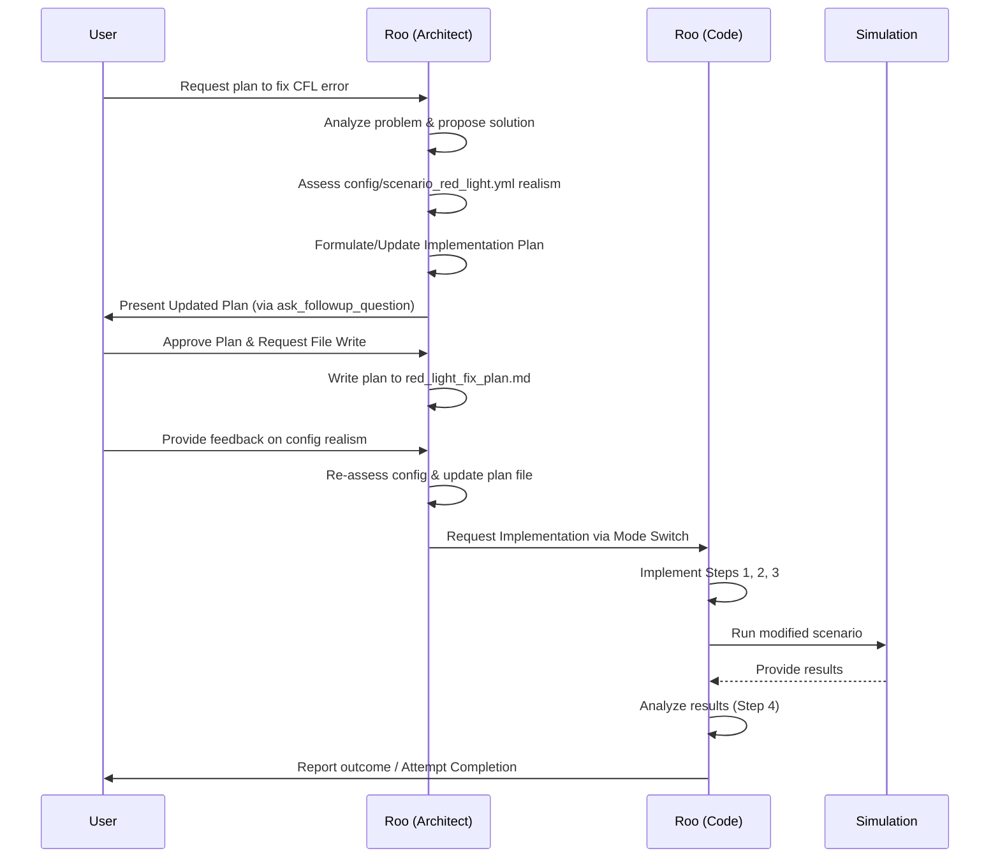

# Plan to Fix CFL Error in Red Light Scenario

**Goal:** Modify the simulation setup to correctly and stably model a traffic blockage (red light) that causes queue formation, resolving the CFL error encountered with previous wall boundary conditions.

**Diagnosis Recap:**

*   The CFL error (`max_abs_lambda = 1000 m/s`) arises because densities near the boundary (`rho_m`, `rho_c`) become non-physically high (`>> rho_jam = 0.25 veh/m`).
*   This causes the pressure derivative (`P'_i`) to explode due to the power-law form `P_i \propto (x/rho_jam)^{\gamma_i}`.
*   Exploding `P'_i` leads to exploding characteristic speeds (`lambda_k`), violating the CFL condition.
*   The standard reflection boundary condition, while aiming for zero flux, creates a ghost state based on these non-physical densities, leading to an unstable interaction with the Central-Upwind numerical scheme.

**Assessment of `config/scenario_red_light.yml`:**

*   The initial conditions (`rho_m=100`, `rho_c=33.33` veh/km, total `rho=133.33` veh/km) represent a moderately dense state (≈53% of `rho_jam=250` veh/km) and seem realistic for testing queue formation.
*   The 75%/25% vehicle composition and R=1 road type are plausible.
*   The inherited base parameters define the model dynamics. The instability appears linked to the *boundary interaction* causing *local* density explosion, not necessarily the initial state or base parameters being inherently unstable at this density.
*   **Conclusion:** No changes to `config/scenario_red_light.yml` are planned *initially*. The focus is on fixing the boundary condition implementation.

**Proposed Solution: Capped Reflection Boundary Condition**

Address the instability by preventing the pressure calculation in the ghost cell from using non-physically high densities. Cap the density used for the ghost state calculation at or slightly below `rho_jam`.

**Implementation Plan:**

1.  **Introduce New Boundary Condition Type:**
    *   **Action:** Define a new boundary condition type, `wall_capped_reflection`.
    *   **Location:** `code/numerics/boundary_conditions.py`.

2.  **Implement Capped Reflection Logic:**
    *   **Action:** Inside the code handling `wall_capped_reflection` for the right boundary:
        *   Retrieve physical state (`rho_phys`, `v_phys`).
        *   Define a density cap: `rho_cap = rho_jam * rho_cap_factor` (e.g., `rho_cap_factor = 0.99`). *Note: `rho_jam` needs to be accessible.*
        *   Calculate ghost densities: `rho_ghost_m = min(rho_phys_m, rho_cap)`, `rho_ghost_c = min(rho_phys_c, rho_cap)`.
        *   Set ghost velocities: `v_ghost = -v_phys`.
        *   Calculate ghost momenta `w_ghost` using `v_ghost` and `P(rho_ghost)` (using the *capped* `rho_ghost`).
        *   Assign `rho_ghost`, `w_ghost` to ghost cells.
    *   **Location:** `code/numerics/boundary_conditions.py`.

3.  **Update Scenario Configuration:**
    *   **Action:** Modify `config/scenario_red_light.yml` to use `wall_capped_reflection` during the red light phase (0-60s).
    *   **Change:** Update `boundary_conditions.right.schedule`.
    *   **Location:** `config/scenario_red_light.yml`.

4.  **Testing and Validation:**
    *   **Action:** Run the modified `red_light_test` scenario.
    *   **Check:** Stability (no CFL error) and Physicality (queue formation/dissipation).
    *   **Contingency:** If instability or unrealistic behavior persists, revisit base parameters (e.g., `K_i`, `gamma_i`, `tau_i`) or initial density as a secondary step.

**Mermaid Diagram:**

**Alternative Approaches (If Capped Reflection is insufficient):**

*   High-Friction Zone in last few cells.
*   Fundamental modification of the Pressure Function `P(rho)`.

---